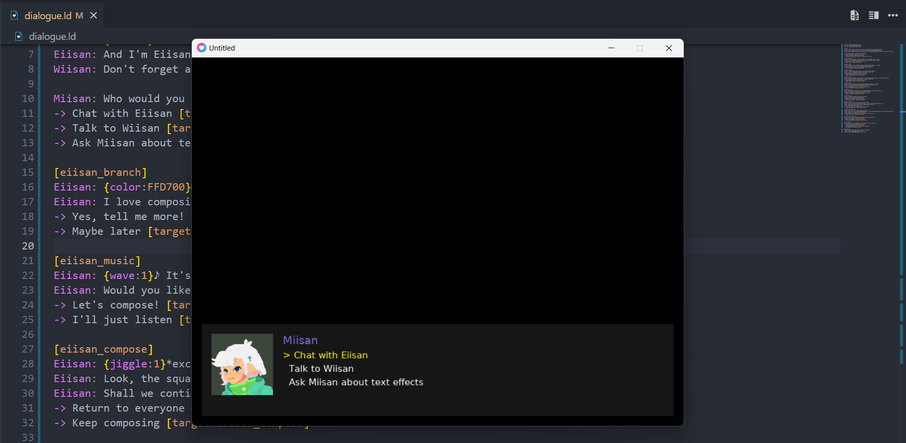

# LoveDialogue


LoveDialogue is a powerful and flexible dialogue system for LÖVE (Love2D) games, featuring rich text effects, branching dialogues, and character portraits.

## Features

- Easy-to-use dialogue system with rich text formatting
- Dynamic text effects (wave, jiggle, shake, color)
- Character portraits support
- Branching dialogue with choices
- Custom callbacks for choice interactions
- Scene labels for better organization
- Fade in/out animations for dialogue boxes
- Theming support
- Auto-layout capabilities
- Typewriter text effect

## Showcase


## Installation

1. Copy the `LoveDialogue` folder into your LÖVE project directory:
2. Require the module in your `main.lua`:

```lua
local LoveDialogue = require "LoveDialogue"
```

## Basic Usage

```lua
local LoveDialogue = require "LoveDialogue"

local myDialogue

function love.load()
    myDialogue = LoveDialogue.play("dialogue.ld")
end

function love.update(dt)
    if myDialogue then
        myDialogue:update(dt)
    end
end

function love.draw()
    if myDialogue then
        myDialogue:draw()
    end
end

function love.keypressed(key)
    if myDialogue then
        myDialogue:keypressed(key)
    end
end
```

## Registering a callback
Callbacks can be really useful when you want certain events run while the dialogue is running.
example: Spawn a red square.

### Basic callback usage
1. Create lua file

```lua
-- mycallback.lua --
local mycallback = {}

mycallback["explode"] = function()
    -- do some code here to make amazing explosions :3 --
end

return mycallback
```

2. After the `Love-Dialogue` setup in the `main.lua`, use the `registerFile` function:

```lua
local success, result = LoveDialogue.callbackHandler.registerFile("mycallback.lua")
```

check the `.ld` syntax above to see how to use callbacks after the setup.

## Dialogue File (.ld) Syntax

### Basic Dialogue
```
Character: This is a basic dialogue line.
AnotherCharacter: This will show after the first line.
```

### Text Effects
```
Character: This text will {wave:1}wave{/wave} and {color:FF0000}be red{/color}.
Character: This text will {jiggle:2}jiggle{/jiggle} and {shake:1}shake{/shake}.
```

### Portraits
```
@portrait Character assets/portraits/character.png
Character: This line will show with the character's portrait!
```

### Choices and Branching
```
[start]
Character: Make a choice:
-> Go to scene A [target:sceneA]
-> Go to scene B [target:sceneB] @callback_name

[sceneA]
Character: You chose scene A!

[sceneB]
Character: You chose scene B!
```

## Configuration Options

You can customize the dialogue system by passing a config table:

```lua
local config = {
    fontSize = 16,                    -- Base font size
    nameFontSize = 18,               -- Character name font size
    boxColor = {0.1, 0.1, 0.1, 0.9}, -- Dialog box background color
    textColor = {1, 1, 1, 1},        -- Text color
    nameColor = {1, 0.8, 0.2, 1},    -- Character name color
    padding = 20,                     -- Box padding
    boxHeight = 150,                  -- Dialog box height
    portraitSize = 100,              -- Size of character portraits
    typingSpeed = 0.05,              -- Text typing speed
    fadeInDuration = 0.5,            -- Fade in animation duration
    fadeOutDuration = 0.5,           -- Fade out animation duration
    portraitEnabled = true,          -- Enable/disable portraits
    autoLayoutEnabled = true         -- Enable/disable auto-layout
}
```

## Theming Support

Create a theme file (`theme.txt`):

```
[theme]
box_color: 26, 26, 26, 230
text_color: 255, 255, 255, 255
name_color: 255, 204, 51, 255
font_size: 16
name_font_size: 18
box_height: 150
padding: 20
typing_speed: 0.05
fade_in: 0.5
fade_out: 0.5
```

Apply the theme:

```lua
myDialogue = LoveDialogue.play("dialogue.ld", {
    theme = "theme.txt"
})
```

## VS Code Extension

For syntax highlighting and better editing experience, use the "Love2D Dialog (.ld) Language Support" extension for Visual Studio Code.

[Download the extension here](https://marketplace.visualstudio.com/items?itemName=miisan-mi.ld-language-support)

## License

This project is licensed under the MIT License - see the [LICENSE](LICENSE) file for details.

## Contributing

Contributions are welcome! Please feel free to submit a Pull Request.
