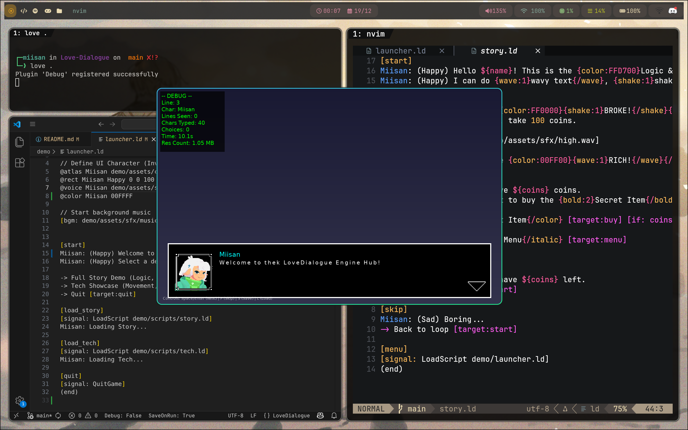
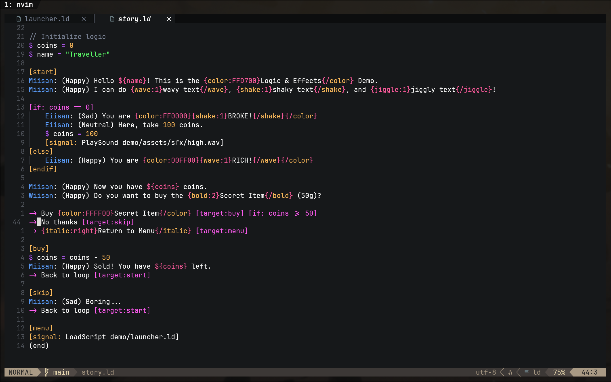

# LoveDialogue

A lightweight, flexible dialogue engine for Love2D with a custom scripting language, rich text effects, and visual novel features.

Grab the latest ready-to-use zip from the [Releases](https://github.com/Miisan-png/Love-Dialogue/releases/latest) page and drop the `LoveDialogue` folder into your project.

## Features

- **Simple Scripting** - Write dialogue in easy-to-read `.ld` format
- **Rich Text Effects** - Wave, shake, color, and nested effects
- **Logic System** - Variables and conditionals
- **Choice System** - Branching narratives with conditional options
- **Signal System** - Trigger Lua callbacks from scripts
- **Portrait System** - Spritesheets, atlases, and animations
- **Theme System** - Customize appearance via theme files
- **Move/Tween** - Animate character portraits
- **Audio** - Voice per character and background music
- **Editor Support** - VS Code and Neovim extensions included

## Screenshots





## Quick Start

```lua
local LoveDialogue = require("LoveDialogue")

function love.load()
    dialogue = LoveDialogue.play("scripts/intro.ld", {
        boxHeight = 200,
        boxWidth = 800,
        centerBox = true,
        boxColor = {0, 0, 0, 1},
        borderColor = {1, 1, 1, 1},
        borderWidth = 3
    })
    
    dialogue.onSignal = function(name, args)
        if name == "GiveItem" then print("Got:", args) end
    end
end

function love.update(dt)
    if dialogue then dialogue:update(dt) end
end

function love.draw()
    if dialogue then dialogue:draw() end
end

function love.keypressed(key)
    if dialogue then dialogue:keypressed(key) end
end
```

## Script Syntax (.ld)

### Character Setup
```ini
@atlas Hero assets/hero.png
@rect Hero Default 0 0 100 100
@rect Hero Happy 100 0 100 100
@voice Hero assets/sfx/voice.wav
@color Hero 00FFFF
```

### Dialogue
```ini
Hero: Hello world!
Hero: (Happy) I'm excited!
Hero: I have ${gold} gold pieces.
```

### Variables & Logic
```ini
$ gold = 100
$ met_boss = true

[if: gold >= 50]
    Merchant: Welcome, valued customer!
[else]
    Merchant: Come back when you have money.
[endif]
```

### Choices
```ini
-> Buy Potion [target:buy] [if: gold >= 50]
-> Leave [target:leave]

[buy]
Merchant: Here you go!
```

### Commands
```ini
[signal: PlaySound explosion.wav]
[move: Hero 100 0 0.5]
[fade: out 1.0]
[fade: in 1.0 #FFFFFF]
[bgm: assets/music.wav]
[load_theme: themes/dark.ld]
```

### Text Effects
```ini
Hero: {wave:1}Wobbly text!{/wave}
Hero: {shake:2}Shaky text!{/shake}
Hero: {color:FF0000}Red text!{/color}
```

## Theme Files

Create `.ld` theme files to customize appearance:

```ini
[theme]
box_color: 0, 0, 0, 255
border_color: 255, 255, 255, 255
border_width: 4
text_color: 255, 255, 255, 255
box_height: 200
box_width: 800
center_box: true
use_nine_patch: false
portrait_size: 140
nine_patch_scale: 2
typing_speed: 0.04
```

## Configuration Options

| Option | Type | Default | Description |
|--------|------|---------|-------------|
| `boxHeight` | number | 150 | Dialogue box height |
| `boxWidth` | number | nil | Box width (nil = full width) |
| `centerBox` | boolean | false | Center the dialogue box |
| `boxColor` | table | {0.1,0.1,0.1,0.9} | Background color |
| `borderColor` | table | {1,1,1,1} | Border color |
| `borderWidth` | number | 0 | Border thickness |
| `useNinePatch` | boolean | false | Use 9-patch for box |
| `ninePatchPath` | string | nil | Path to 9-patch image |
| `ninePatchScale` | number | 1 | 9-patch scale factor |
| `portraitSize` | number | 100 | Portrait dimensions |
| `portraitEnabled` | boolean | true | Show portraits |
| `typingSpeed` | number | 0.05 | Seconds per character |

## Editor Extensions

### VS Code
Install from `tools/ld-vscode/ld-language-support-1.2.0.vsix`

### Neovim
Copy `tools/ld-nvim/` to your config:
```bash
cp -r tools/ld-nvim/* ~/.config/nvim/
```

## License

MIT License
