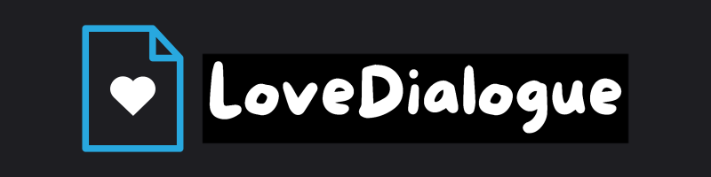
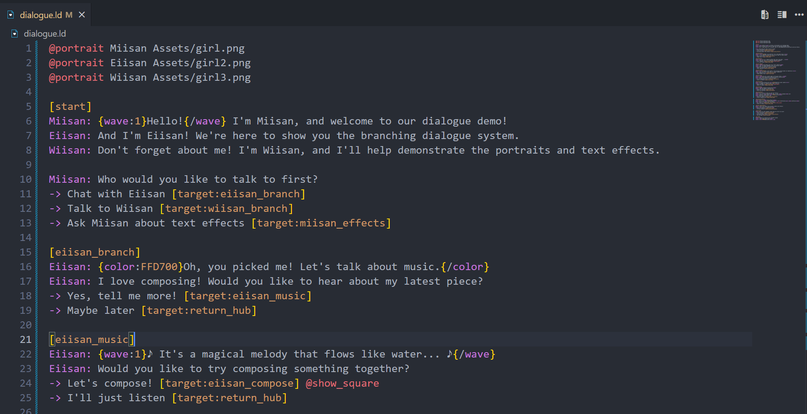

# LoveDialogue



LoveDialogue is a simple and flexible dialogue system for LÖVE (Love2D) games.

## Features

- Easy-to-use dialogue system
- Fade in/out animations for dialogue boxes
- Custom scripting language for dialogue files


## InAction
https://github.com/user-attachments/assets/b52541d0-1634-4d92-8450-a747c7d3b913


## Installation

1. Copy the `LoveDialogue.lua` and `LoveDialogueParser.lua` files into your LÖVE project directory.
2. Require the module in your `main.lua` file:

```lua
local LoveDialogue = require "LoveDialogue"
```

## Usage

1. Create a dialogue file with the `.ld` extension (e.g., `dialogue.ld`).
2. In your `main.lua`, load and start the dialogue:

```lua
function love.load()
    myDialogue = LoveDialogue.play("dialogue.ld")
end

function love.update(dt)
    if myDialogue then
        myDialogue:update(dt)
    end
end

function love.draw()
    if myDialogue then
        myDialogue:draw()
    end
end

function love.keypressed(key)
    if (key == "space" or key == "return") and myDialogue then
        myDialogue:advance()
    end
end
```

## Dialogue File Syntax

Dialogue files use a simple syntax:

```
Character: Dialogue text goes here.
AnotherCharacter: More dialogue text.
```

## Customization

You can customize the appearance of the dialogue box by modifying the properties in the `LoveDialogue:new()` function.

## VS Code Extension

For a better editing experience and syntax highlighting, I recommend using the "Love2D Dialog (.ld) Language Support" extension for Visual Studio Code. I made this extension specifically for this library. This extension provides syntax highlighting for .ld files.

[Download the extension here](https://marketplace.visualstudio.com/items?itemName=miisan-mi.ld-language-support)

## Showcase



## License

This project is licensed under the MIT License - see the [LICENSE](LICENSE) file for details.

## Contributing

Contributions are welcome! Please feel free to submit a Pull Request.
